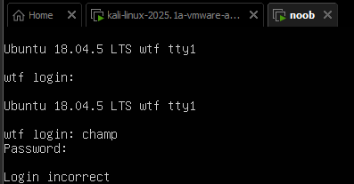
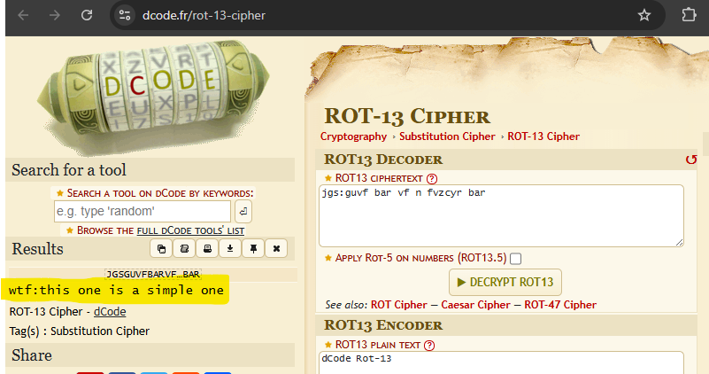

https://www.vulnhub.com/entry/noob-1,746/

Find the IP of the target `noob` machine

```
nmap 192.168.97.0/24 -O
```

Scan the target `noob` machine

```
nmap -sS -sV 192.168.97.128
```

```
└─$ nmap -sS -sV 192.168.97.128    
Starting Nmap 7.95 ( https://nmap.org ) at 2025-04-27 12:06 EDT
Nmap scan report for 192.168.97.128
Host is up (0.0023s latency).
Not shown: 998 filtered tcp ports (no-response)
PORT   STATE SERVICE VERSION
21/tcp open  ftp     vsftpd 3.0.3
80/tcp open  http    Apache httpd 2.4.29 ((Ubuntu))
Service Info: OS: Unix

Service detection performed. Please report any incorrect results at https://nmap.org/submit/ .
Nmap done: 1 IP address (1 host up) scanned in 14.49 seconds
```

It runs
```
ftp/21
http/80
```

---

Now also scan it using RustScan

```
rustscan -a 192.168.97.128
```

```
└─$ rustscan -a 192.168.97.128
.----. .-. .-. .----..---.  .----. .---.   .--.  .-. .-.
| {}  }| { } |{ {__ {_   _}{ {__  /  ___} / {} \ |  `| |
| .-. \| {_} |.-._} } | |  .-._} }\     }/  /\  \| |\  |
`-' `-'`-----'`----'  `-'  `----'  `---' `-'  `-'`-' `-'
The Modern Day Port Scanner.
________________________________________
: http://discord.skerritt.blog         :
: https://github.com/RustScan/RustScan :
 --------------------------------------
TreadStone was here 🚀

[~] The config file is expected to be at "/home/kali/.rustscan.toml"
[!] File limit is lower than default batch size. Consider upping with --ulimit. May cause harm to sensitive servers
[!] Your file limit is very small, which negatively impacts RustScan's speed. Use the Docker image, or up the Ulimit with '--ulimit 5000'. 
Open 192.168.97.128:21
Open 192.168.97.128:80
Open 192.168.97.128:55077
[~] Starting Script(s)
[~] Starting Nmap 7.95 ( https://nmap.org ) at 2025-04-27 15:10 EDT
Initiating ARP Ping Scan at 15:10
Scanning 192.168.97.128 [1 port]
Completed ARP Ping Scan at 15:10, 0.05s elapsed (1 total hosts)
Initiating Parallel DNS resolution of 1 host. at 15:10
Completed Parallel DNS resolution of 1 host. at 15:10, 2.01s elapsed
DNS resolution of 1 IPs took 2.01s. Mode: Async [#: 1, OK: 1, NX: 0, DR: 0, SF: 0, TR: 1, CN: 0]
Initiating SYN Stealth Scan at 15:10
Scanning 192.168.97.128 (192.168.97.128) [3 ports]
Discovered open port 21/tcp on 192.168.97.128
Discovered open port 80/tcp on 192.168.97.128
Discovered open port 55077/tcp on 192.168.97.128
Completed SYN Stealth Scan at 15:10, 0.02s elapsed (3 total ports)
Nmap scan report for 192.168.97.128 (192.168.97.128)
Host is up, received arp-response (0.00067s latency).
Scanned at 2025-04-27 15:10:06 EDT for 0s

PORT      STATE SERVICE REASON
21/tcp    open  ftp     syn-ack ttl 64
80/tcp    open  http    syn-ack ttl 64
55077/tcp open  unknown syn-ack ttl 64
MAC Address: 00:0C:29:A6:A6:70 (VMware)

Read data files from: /usr/share/nmap
Nmap done: 1 IP address (1 host up) scanned in 2.19 seconds
           Raw packets sent: 4 (160B) | Rcvd: 4 (160B)
```

It runs
```
ftp/21
http/80
????/55077
```

---
What is running on port 55077?

```
nmap -sV -p 55077 192.168.97.128
```

```
└─$ nmap -sV -p 55077 192.168.97.128

Starting Nmap 7.95 ( https://nmap.org ) at 2025-04-27 15:14 EDT
Nmap scan report for 192.168.97.128 (192.168.97.128)
Host is up (0.00098s latency).

PORT      STATE SERVICE VERSION
55077/tcp open  ssh     OpenSSH 7.6p1 Ubuntu 4ubuntu0.5 (Ubuntu Linux; protocol 2.0)
MAC Address: 00:0C:29:A6:A6:70 (VMware)
Service Info: OS: Linux; CPE: cpe:/o:linux:linux_kernel

Service detection performed. Please report any incorrect results at https://nmap.org/submit/ .
Nmap done: 1 IP address (1 host up) scanned in 2.53 seconds
```

---
Check if ftp supports anonymous login

```
msfconsole
```

```
search ftp anonymous
```

```
use auxiliary/scanner/ftp/anonymous
```

```
show options
```

```
msf6 auxiliary(scanner/ftp/anonymous) > show options

Module options (auxiliary/scanner/ftp/anonymous):

   Name     Current Setting      Required  Description
   ----     ---------------      --------  -----------
   FTPPASS  mozilla@example.com  no        The password for the specified username
   FTPUSER  anonymous            no        The username to authenticate as
   RHOSTS                        yes       The target host(s), see https://docs.metasploi
                                           t.com/docs/using-metasploit/basics/using-metas
                                           ploit.html
   RPORT    21                   yes       The target port (TCP)
   THREADS  1                    yes       The number of concurrent threads (max one per
                                           host)


View the full module info with the info, or info -d command.
```

```
set RHOSTS 192.168.97.128
```

```
msf6 auxiliary(scanner/ftp/anonymous) > run
[+] 192.168.97.128:21     - 192.168.97.128:21 - Anonymous READ (220 (vsFTPd 3.0.3))
[*] 192.168.97.128:21     - Scanned 1 of 1 hosts (100% complete)
[*] Auxiliary module execution completed
msf6 auxiliary(scanner/ftp/anonymous) > 
```

It shows:
- It is running vsFTPd 3.0.3
- Has anonymous access with read only access

---

Try logging in without entering username and password

```
└─$ ftp 192.168.97.128
Connected to 192.168.97.128.
220 (vsFTPd 3.0.3)
Name (192.168.97.128:kali): 
331 Please specify the password.
Password: 
dir
l530 Login incorrect.
ftp: Login failed
ftp> dir
530 Please login with USER and PASS.
530 Please login with USER and PASS.
ftp: Can't bind for data connection: Address already in use
```

---

Try logging in using `anonymous` and empty password

```
└─$ ftp 192.168.97.128
Connected to 192.168.97.128.
220 (vsFTPd 3.0.3)
Name (192.168.97.128:kali): anonymous
331 Please specify the password.
Password: 
230 Login successful.
Remote system type is UNIX.
Using binary mode to transfer files.
ftp> 
```

---

```
ftp> dir
229 Entering Extended Passive Mode (|||33968|)
150 Here comes the directory listing.
-rw-r--r--    1 0        0              21 Sep 21  2021 cred.txt
-rw-r--r--    1 0        0              86 Jun 11  2021 welcome
226 Directory send OK.
ftp> dir
229 Entering Extended Passive Mode (|||64152|)
150 Here comes the directory listing.
-rw-r--r--    1 0        0              21 Sep 21  2021 cred.txt
-rw-r--r--    1 0        0              86 Jun 11  2021 welcome
226 Directory send OK.
```

```
ftp> cat cred.txt
?Invalid command.
ftp> type cred.txt
cred.txt: unknown mode.
ftp> get cred.txt
local: cred.txt remote: cred.txt
229 Entering Extended Passive Mode (|||37969|)
150 Opening BINARY mode data connection for cred.txt (21 bytes).
100% |**********************************************|    21       36.55 KiB/s    00:00 ETA
226 Transfer complete.
21 bytes received in 00:00 (8.47 KiB/s)
ftp> 
```

```
┌──(kali㉿kali)-[~]
└─$ ls
cred.txt  Desktop  Documents  Downloads  Music  Pictures  Public  Templates  Videos
                                                                                           
┌──(kali㉿kali)-[~]
└─$ cat cred.txt 
Y2hhbXA6cGFzc3dvcmQ=
```

Looks like base64 encoding

Decode it.

```
└─$ cat cred.txt | base64 -d
champ:password 
```

When booting the target virtual machine, you are prompted to provide credentials.
Let's try them out.



It does not work.

The target machine also runs an http service.
Let's inspect the page via the attacker machine.


Click on About Us. It will start a download.


```
cd ~ ;
cd Downloads ;
unrar x downloads.rar
```

```
└─$ unrar x downloads.rar 

UNRAR 7.10 freeware      Copyright (c) 1993-2025 Alexander Roshal


Extracting from downloads.rar

Creating    downloads                                                 OK
Extracting  downloads/funny.jpg                                       OK 
Extracting  downloads/funny.bmp                                       OK 
Extracting  downloads/sudo                                            OK 
All OK
```

```
cd downloads ;

cat sudo ;
```

```
┌──(kali㉿kali)-[~/Downloads/downloads]
└─$ cat sudo                
Did you notice the file name? Isn't is interesting?
```

I have no idea what is meant by this.

However, when I would inspect funny.jpg and funny.bmp, I would find the image below...which is not funny at all. And I think this is a hint there is something going on with these images.


---

Inspect the contents of the images

Steghide


sudo apt update ;
sudo apt install -y steghide ;

```
┌──(kali㉿kali)-[~/Downloads/downloads]
└─$ steghide extract -sf funny.jpg
Enter passphrase: 
wrote extracted data to "hint.py".
                                                                                                                    
┌──(kali㉿kali)-[~/Downloads/downloads]
└─$ steghide extract -sf funny.bmp
Enter passphrase: 
steghide: could not extract any data with that passphrase!
                                                                                                                    
┌──(kali㉿kali)-[~/Downloads/downloads]
└─$ 
```

```
┌──(kali㉿kali)-[~/Downloads/downloads]
└─$ cat hint.py             
This is_not a python file but you are revolving around.
well, try_ to rotate some words too.
```

I could not extract the contents of funny.bmp using steghide since I do not know the password.

I got stuck here for some time, until I remembered we had this weird "sudo" file that had a weird message inside it: `Did you notice the file name? Isn't is interesting?`. Could `sudo` be the password? It indeed is.

It provided me the following file:

```
└─$ cat user.txt 
jgs:guvf bar vf n fvzcyr bar
```

This seems encoded. Perhaps by some simple alphabet shifting cipher.

I went to the following site to examine my encoded string.

https://www.dcode.fr/cipher-identifier


As you see, the site suggests that I take a look into the ROT-13 Cipher.

By clicking on the suggested cipher, it redirected me to a ROT-13 decrypt tool on the same site.

https://www.dcode.fr/rot-13-cipher



The string was indeed encoded using the ROT-13 cipher and it hid the text: 
`wtf:this one is a simple one`.

This string does not make a lot of sense.
But the formatting of it gives a hint what it could be related to.
Typically credentials are written as `username:password`.
Could it be, this string contains a username (`wtf`) and password `this one is a simple one`? And for what service?

Maybe it has to do with this ssh service on port `55077`

```
ssh wtf@192.168.97.128 -p 55077
```

```
└─$ ssh wtf@192.168.97.128 -p 55077                           
The authenticity of host '[192.168.97.128]:55077 ([192.168.97.128]:55077)' can't be established.
ED25519 key fingerprint is SHA256:7llosBA8c0IhGD0Q/MfctQSSVRtzJrF8OOBmRA58IyE.
This key is not known by any other names.
Are you sure you want to continue connecting (yes/no/[fingerprint])? yes
Warning: Permanently added '[192.168.97.128]:55077' (ED25519) to the list of known hosts.
wtf@192.168.97.128's password: 
```

```
Welcome to Ubuntu 18.04.5 LTS (GNU/Linux 4.15.0-156-generic x86_64)

 * Documentation:  https://help.ubuntu.com
 * Management:     https://landscape.canonical.com
 * Support:        https://ubuntu.com/advantage

  System information as of Sun Apr 27 19:17:13 UTC 2025

  System load:  0.02              Processes:            175
  Usage of /:   49.6% of 8.79GB   Users logged in:      0
  Memory usage: 26%               IP address for ens33: 192.168.97.128
  Swap usage:   0%
```

```
wtf@wtf:~$ ls
Desktop  Documents  Downloads  Music  Pictures  Public
wtf@wtf:~$ cd ..
wtf@wtf:/home$ ls
rooot  wtf
wtf@wtf:/home$ cd ..
wtf@wtf:/$ ls
bin    etc             lib         mnt   run   swap.img  var
boot   home            lib64       opt   sbin  sys       vmlinuz
cdrom  initrd.img      lost+found  proc  snap  tmp       vmlinuz.old
dev    initrd.img.old  media       root  srv   usr
wtf@wtf:/$ cd home/
wtf@wtf:/home$ cd rooot/
wtf@wtf:/home/rooot$ ls
flag.txt
wtf@wtf:/home/rooot$ cat flag.txt 
A Rabbit Hole?
Not sure!

Well, look for the thing you want.
It's just 2 steps ahead :)
wtf@wtf:/home/rooot$ 
```

---

```
sudo find / -name "flag*"
```

This showed there is a flag file in /home/wtf/Documents


```
wtf@wtf:~$ cd Downloads/
wtf@wtf:~/Downloads$ ls
flag-1.txt
wtf@wtf:~/Downloads$ cat flag-1.txt 
VGhlIGZsYWcgaXMgdGhlIGVuY29kZWQgc3RyaW5nIGl0c2VsZg
wtf@wtf:~/Downloads$ 
```

---

```
sudo find / -name "flag*"
```

This showed there is a root.txt file in /root/

```
wtf@wtf:~$ sudo cat /root/root.txt
RW5kb3JzZSBtZSBvbiBsaW5rZWRpbiA9PiBodHRwczovL3d3dy5saW5rZWRpbi5jb20vaW4vZGVlcGFrLWFoZWVyCg==

Follow me on Twitter https://www.twitter.com/Deepakhr9

TryHackMe --> https://www.tryhackme.com/p/Malwre99
Github --> https://www.github.com/Deepak-Aheer
(the flag is my LinkedIn username)


        THANK YOU for PLAYING THIS CTF

        But REMEMBER we're still N00bs ;)
```